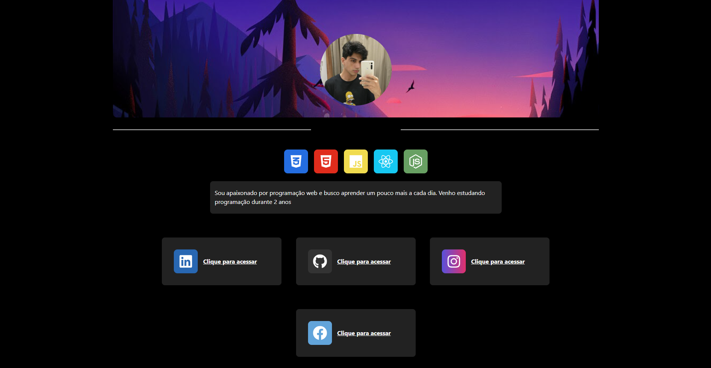

# Meu perfil 🧙‍♂️
## Nesse mini projeto eu crio uma interface para divulgar minhas redes e as techs que eu uso 

### Passos para iniciar o projeto!
<ul>
    <li>Faça o clone do projeto 👥</li>
    <li>Acesse a pasta raiz do projeto 🌳</li>
    <li>Rode o comando `npm install` ou `yarn install` para adicionar as dependências 🚀</li>
</ul>

Esse projeto serve para compartilhar minhas redes sociais e mostrar as techs que estudo e uso no dia a dia. 

